# OurShop
E-Commerce Website with Django + Reactjs
<h1 align=center>E-Commerce Website with Django + Reactjs</h1>

###to run project
#run django 
-.\env\Scripts\activate
-cd ecommerceback
-pip install -r requirements.txt
-python manage.py runserver

#run reactjs
-cd ecommerce-front
-npm install
-npm start
##ERD 
 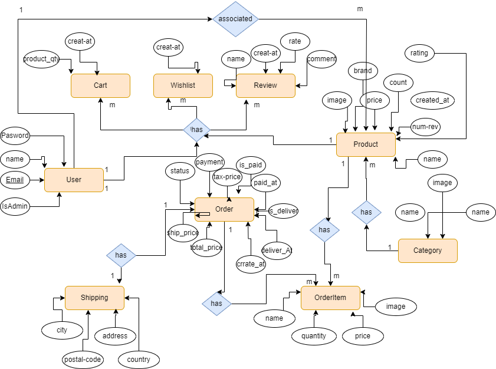

 ##Project Screens
 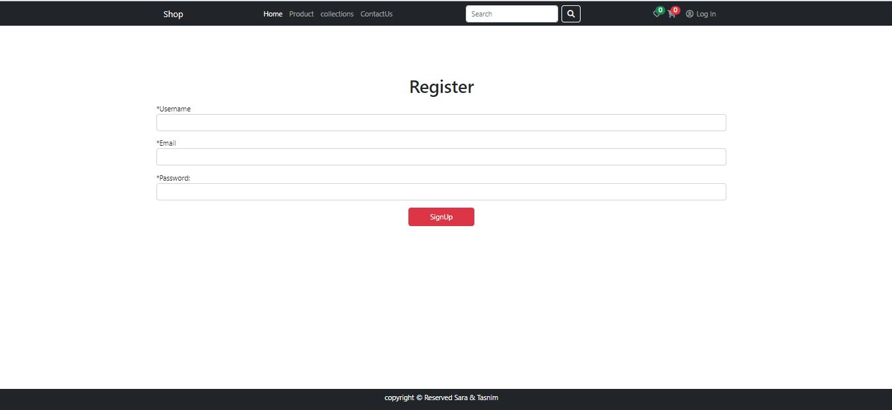
 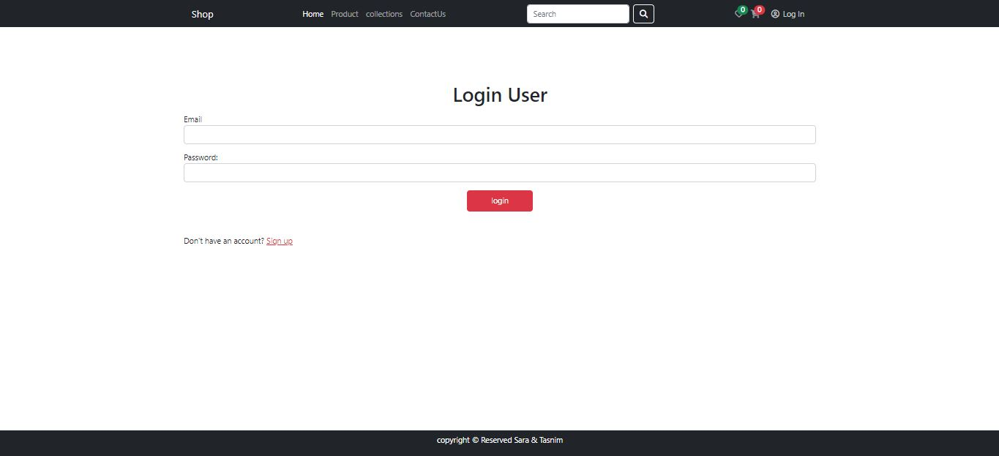
 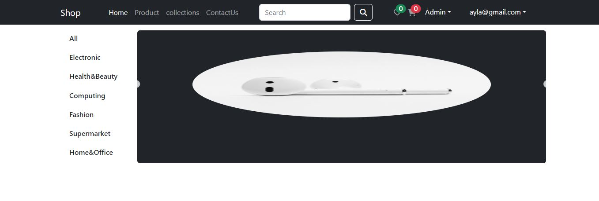
 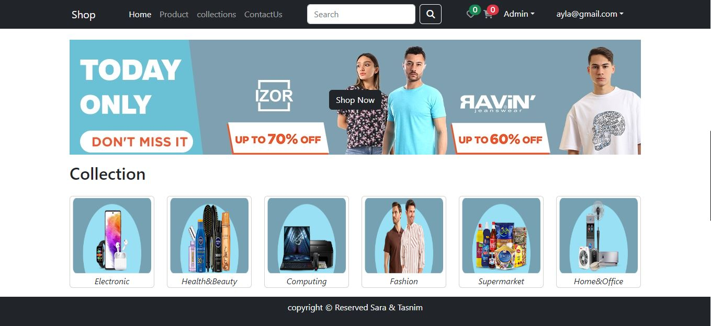
 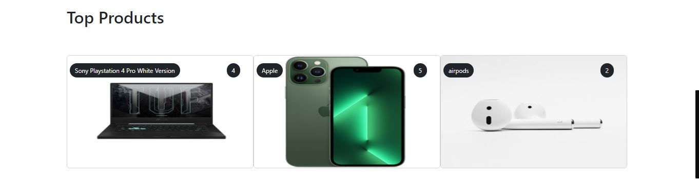
 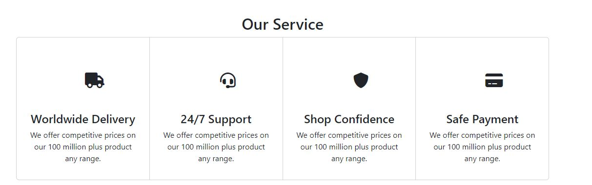
 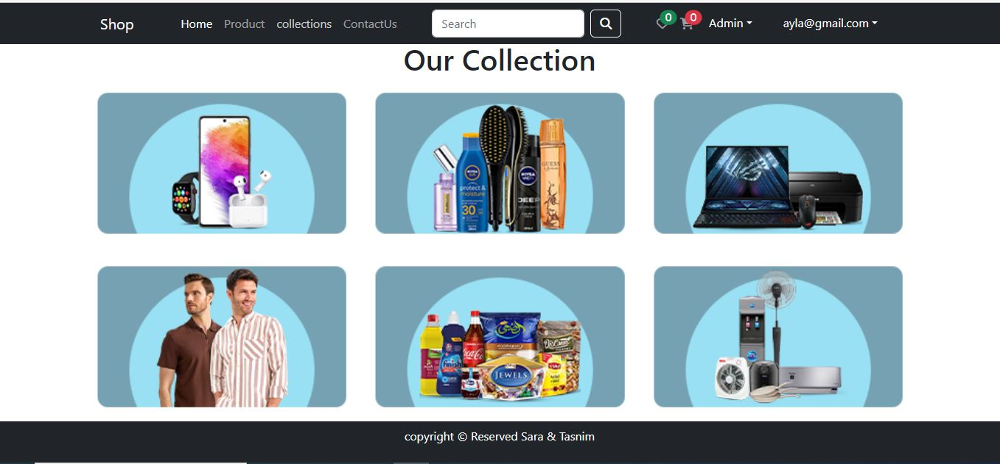
 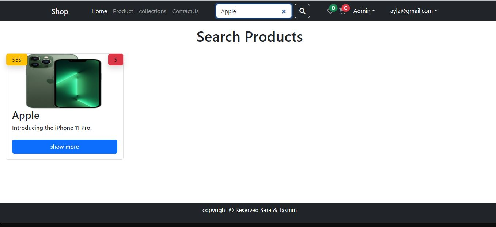
 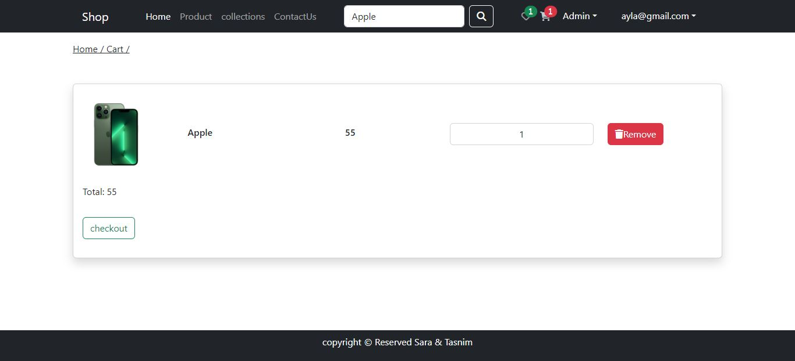
 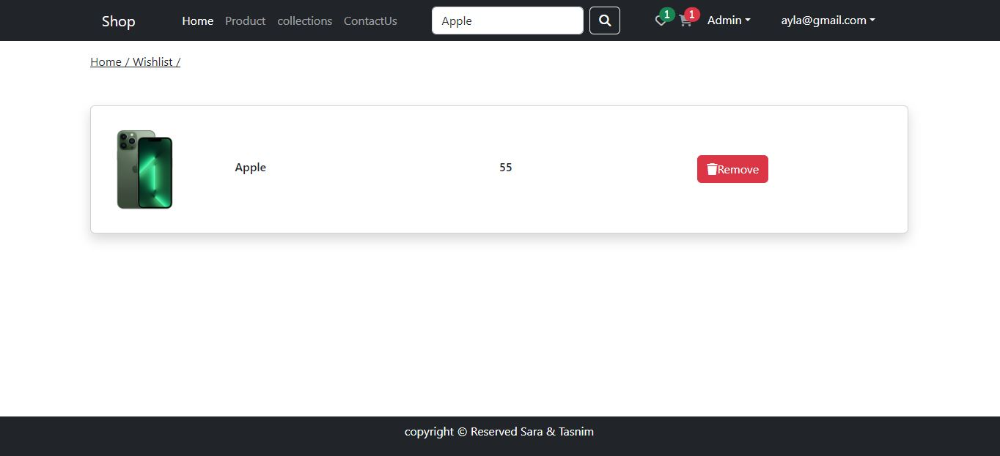
 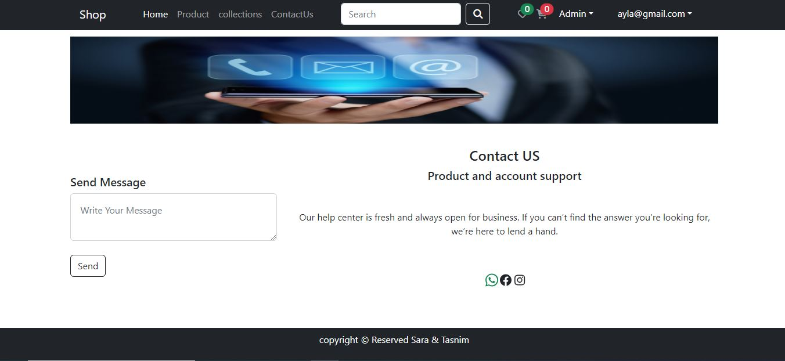

##Project Features
-Full featured shopping cart
-Product reviews and Ratings
-Product search
-Admin category management
-Admin product management
-Admin user management
-Admin Order details page
-Mark orders as a delivered option
-Checkout process (shipping, payment method, placeOrder)
-PayPal / credit card integration
-users can update their profiles
-email  sent to user if user place an order or cancel an order 
-allow users to  contact with marchent
-allow users to  filter with product
-allow users to add products to their wishlist 
-users can update their profiles

